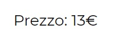

# Js-biglietto-treno
The website asks the user the number of kilometers and his age.
Using this information the price of the ticket will be calculated as follows: 0.21€/km and if the user is underage a discount of 20% is applied whereas if the user is over 65, 40%.
***
### [Live Version](https://gianluigivitale.github.io/js-biglietto-treno/)
***
### Preview:

